- [等你长大后可能没有“工作”](#等你长大后可能没有工作)
  - [几个国外已经发布的ai教育类产品](#几个国外已经发布的ai教育类产品)
  - [一个例子从来没有写过代码的人是如何用：gpt4+replit实现贪吃蛇](#一个例子从来没有写过代码的人是如何用gpt4replit实现贪吃蛇)
    - [步骤一](#步骤一)
    - [步骤二：把代码输入到replit里面进行运行](#步骤二把代码输入到replit里面进行运行)
    - [步骤三：成果体验和调整](#步骤三成果体验和调整)
- [为什么要学编程呢？](#为什么要学编程呢)
  - [获取真正的快乐的同时未来也能安身立命](#获取真正的快乐的同时未来也能安身立命)
  - [我们未来的学习编程计划是什么？](#我们未来的学习编程计划是什么)
- [第一次课程开始](#第一次课程开始)
  - [变量的数据类型知识点](#变量的数据类型知识点)
    - [如何理解变量](#如何理解变量)
    - [习题](#习题)
    - [自动类型转换](#自动类型转换)
    - [习题2](#习题2)
    - [习题3](#习题3)
    - [习题4](#习题4)
  - [变量的输入输出](#变量的输入输出)
    - [第一题](#第一题)
    - [第二题](#第二题)
    - [第三题](#第三题)
  - [顺序结构程序设计案例](#顺序结构程序设计案例)
    - [第一题](#第一题-1)
    - [第二题](#第二题-1)
    - [第三题](#第三题-1)
- [作业](#作业)

# 等你长大后可能没有“工作”

人类具有两种能力：身体能力和认知能力。
过去，机器主要是在原始的身体能力方面和人类进行竞争。人类在认知能力领域具体巨大优势。
然而现在，机器在认知能力方面也开始超越人类。

人们普遍认为，机器学习和机器人将改变几乎所有的工作，从制作酸奶到教授瑜伽都无法幸免。
如教育，无人驾驶，传统意义上的工作（文员等）可能等你长大这些工作都要没有了。

## 几个国外已经发布的ai教育类产品

    老师助手--profjim
  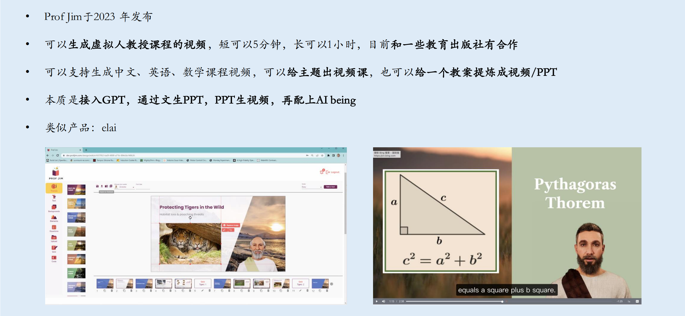  
    
    学生助手--speak
  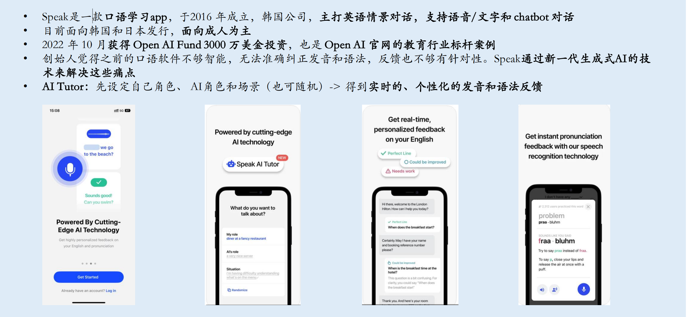  
    
    家长助手--storywizard
  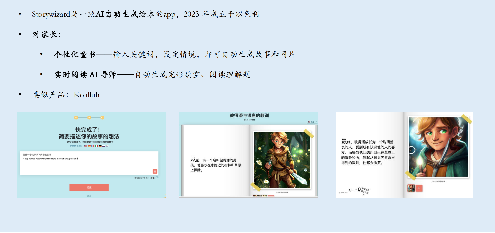  

## 一个例子从来没有写过代码的人是如何用：gpt4+replit实现贪吃蛇

### 步骤一
    告诉GPT自己需要它做一款贪吃蛇游戏，需要它提供代码（最好写上自己要用replit，这样代码才更适用）
  
  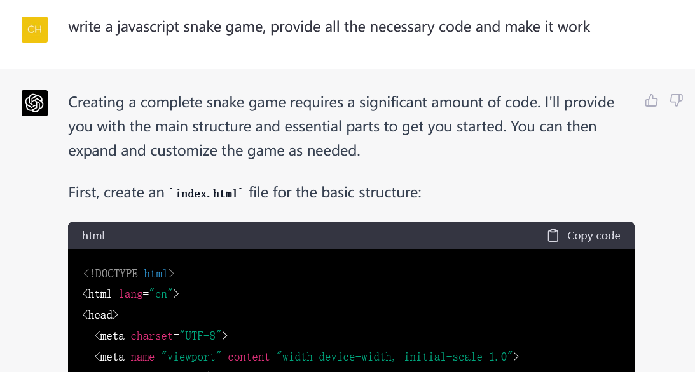  
  
  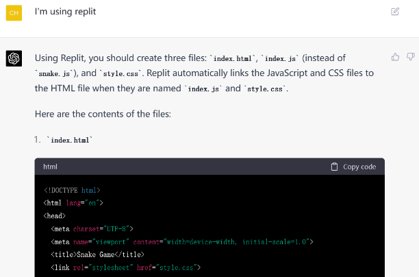  
  
    有了这个指令后，GPT会生成3个不同标题的对话框，对应我们之后需要输入到replit网站上的时候对应的模板，分别是html、css和javascript。
  
  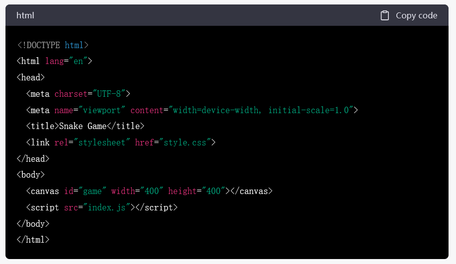 
  
  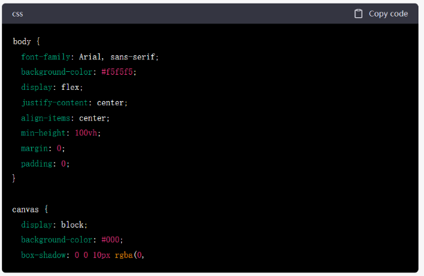
  
  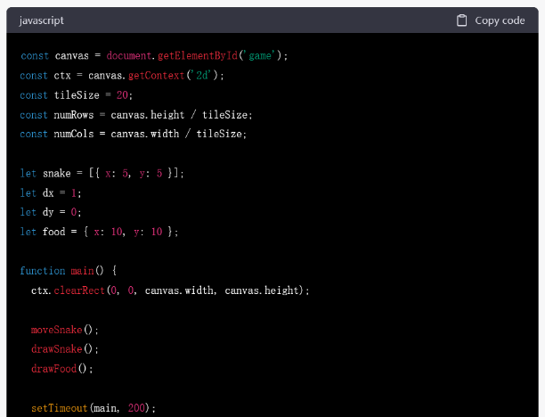  

### 步骤二：把代码输入到replit里面进行运行

    先注册一个免费的replit账号，然后登录进去在搜索栏里输入html，选择出来的第一个模板——html, css, js。
  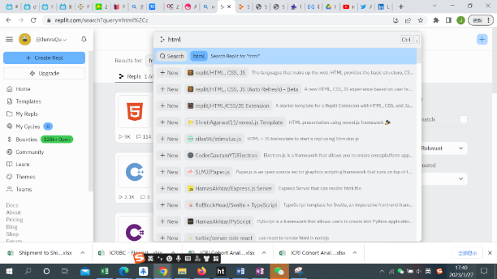  
    
    在这里随便输入一个title然后点Create Repl
  
  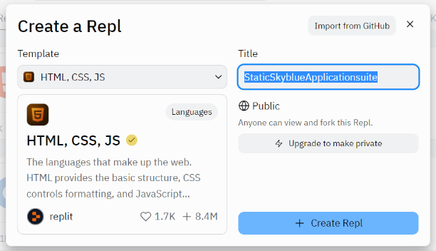 

    然后把之前GPT给出的html那个对话框里的文字都复制到index.html这个对话框中，这里要注意它自动生成的代码里面第11行那里可能写的是，注意这里需要让这个xxxx.js和模板里的第二个（也就是我们这个截图里的script.js）名称完全一致
  
  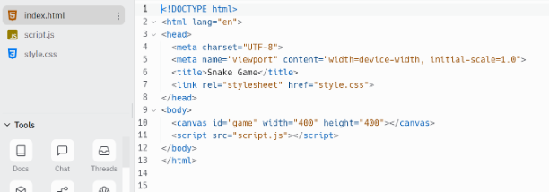  

    css的内容贴到style.css的框里，JavaScript的内容贴到script.js的对话框里
  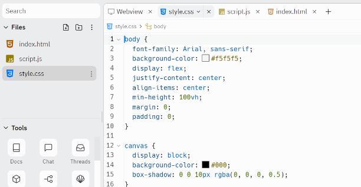 
  
  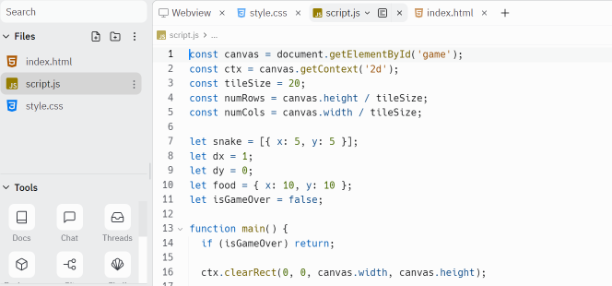 

    都贴进去了之后点击最上面的run，就可以运行程序得到网页了 
### 步骤三：成果体验和调整
    一开始生成的版本如下，是一个网页版的小游戏，不过有一个bug就是游戏不会停止，即使贪吃蛇撞到墙了，再接着按一下方向键还能继续。

  <video id="video" controls="" preload="none" poster="">
  <source id="mp4" src="./images/2023-05-21/Snake_Game_1.mp4" type="video/mp4">
  </video>

    继续让gpt进行修改

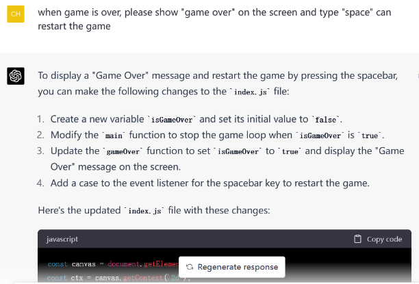{width="60%" height="60%"}

    最终结果
  <video id="video" controls="" preload="none" poster="">
  <source id="mp4" src="./images/2023-05-21/Snake_Game_2.mp4" type="video/mp4">
  </video>

步骤二 

# 为什么要学编程呢？

## 获取真正的快乐的同时未来也能安身立命
    快乐是什么？

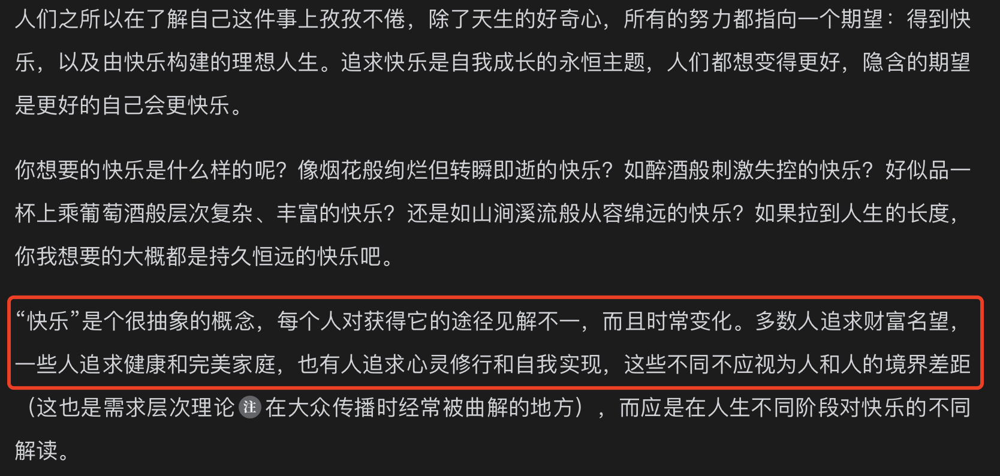

    心理学家定义的快乐

    ● 享乐：充满享受的生理体验，包含喜悦、狂喜、温暖、舒适等对当下积极情境的主观感受，代表的是“愉悦的人生”。

    ● 投入：在参与家庭、工作、爱情与个人爱好等活动时体验到的心流。心流是一种延绵不绝、内心充实的快乐。这种快乐不需要外部奖励，是属于内源性的，当完全沉浸其中时，时间好像停止了，自我意识消失了，代表的是“沉浸的人生”。

    ● 意义：充满释放自我潜能的动力，能为达到超越当前能力的目标不断行动。意义带给人的既有主观感受，也有客观判断，感受到的是先抑后扬的高峰快乐，代表的是“有价值的人生”。
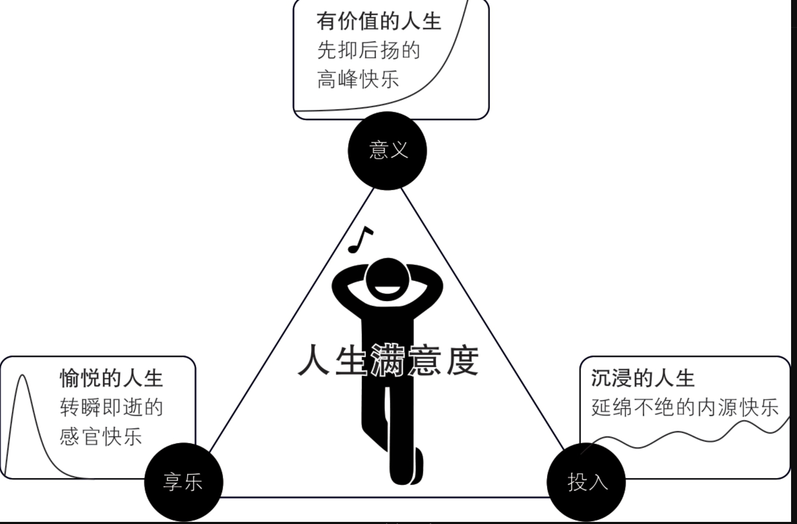

    不可持续的快乐
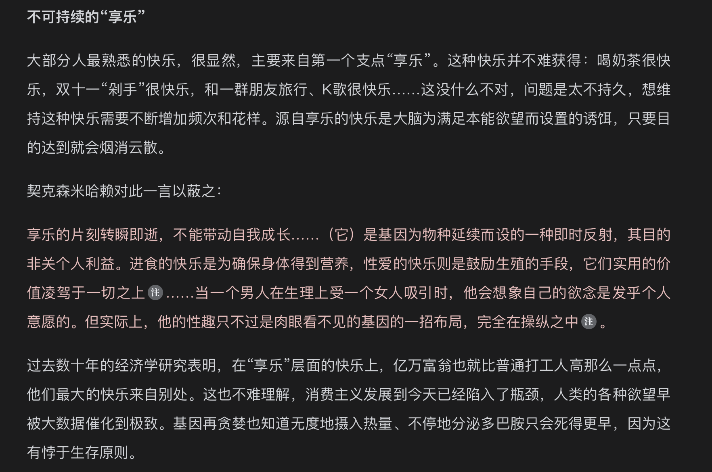

    当下的快乐充满了敷衍和无奈，我们不是不向往更高级的快乐，但是这太难了。
    个中差异多数人并非体会不到，这也是为什么那句TVB名言“做人最重要的是开心”经常会被人调侃。 
    虽然能体会，但人们还是将“享乐”作为首要的快乐来源，因为它触手可及，付出金钱或时间就能保证得到，而“投入”和“意义”虚无缥缈，令人无从下手。
    那么，追求“投入”和“意义”的快乐到底难在哪里呢？难在不确定。

    为什么爱玩游戏？
    因为游戏的规则是确定的，你知道自己做了什么就会得到什么，而且这个过程是可控的，你可以随时停下来。
    掌控命运的欲望是人类一切行为的终极动机。
  
  
  耐心地做正确的事。

  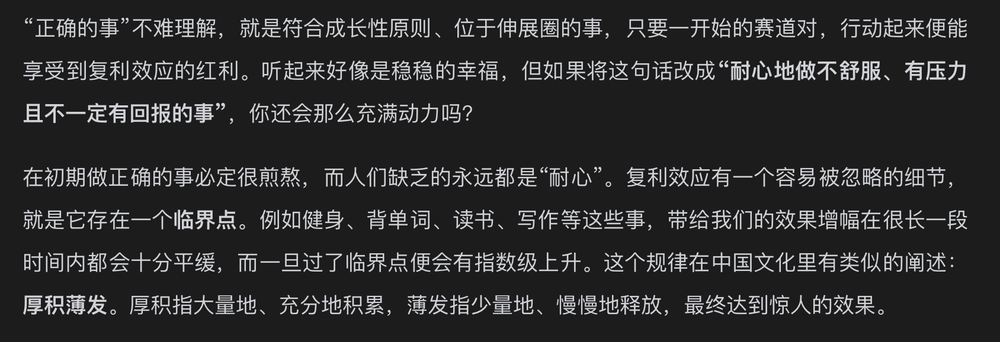

  
  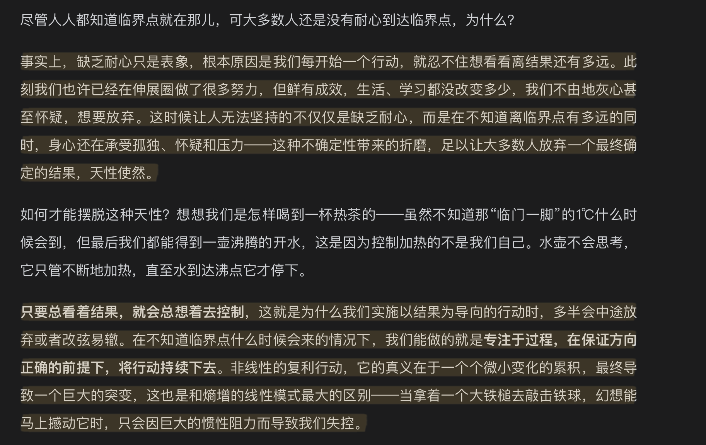

## 我们未来的学习编程计划是什么？

  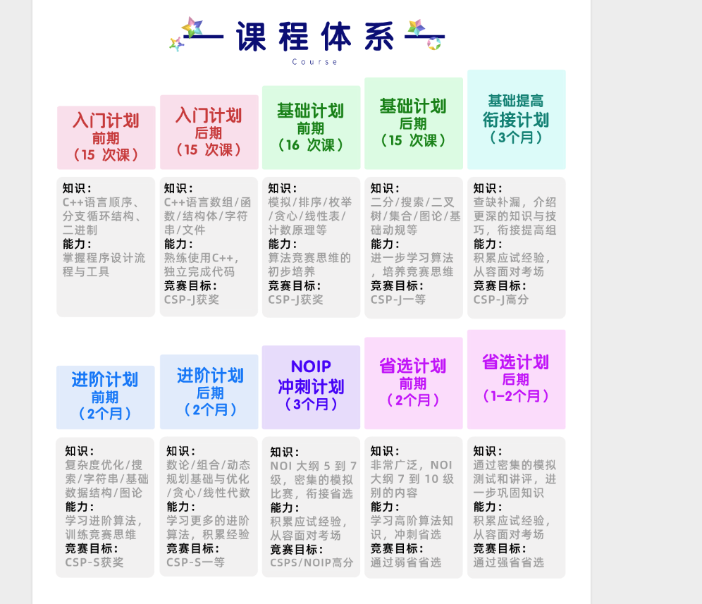

  
# 第一次课程开始

## 变量的数据类型知识点

### 如何理解变量
    以做菜为例子，首先处理好了一种原材料，然后再处理另外一种。不可能将所有的原材料都拿在手上。
    因此需要拿一个容器，把原料放到容器里，并放到操作台的空位里面，等需要的时候再拿来用。

    原材料--数据
    容器--变量
    操作台--内存
    一般来说，不会把一只鸡和一撮葱花放到一个容器里面，也不会把鸡汤放到菜篮子里。
    c++有很多种变量类型，能够存储的数据精度和范围都不一样，因此需要根据需要选择合适的变量类型。

  | 数据类型            | 占用空间 | 取值范围                             |
  | ------------------- | -------- | ------------------------------------ |
  | bool                | 1 字节   | true/false                           |
  | char                | 1 字节   | -128 到 127 或 0 到 255              |
  | int                 | 4 字节   | -231 到 231- 1 |
  | unsigned int        | 4 字节   | 0 到 232- 1               |
  | long long           | 8 字节   | -263 到 263- 1 |
  | unsigned  long long | 8 字节   | 0 到 264- 1               |
  | float               | 4 字节   | 大约指数绝对值不超过376位数字        |
  | double              | 8 字节   | 大约指数绝对值不超过30715位有效数字  |

### 习题
    小明跑步的速度5m/s,小红跑步的速度是8m/s,小红在小明后面100m，他俩同时起跑，小红追上小明需要多长时间？
    请用c++程序输出结果。

### 自动类型转换

### 习题2

    英文字母中。英文有26个字母，其中A是第一个字母，现在请用编程求出
    1.M是第几个字母？
    2.第18个字母是什么？

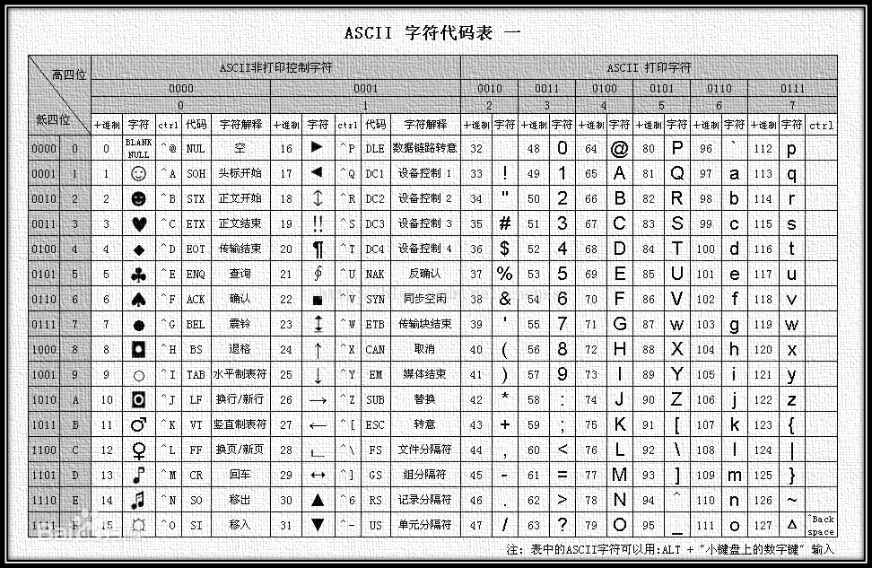  
ASCII码表

### 习题3
    玩橡皮泥，小A有两块橡皮泥，一个半径是4，一个是半径为10。他想把两块橡皮泥揉在一起，塑造成一个正方体。请问他最后塑造出来的正方体的边长是多少？
    如果结果不是整数，则舍去小数点之后的数字，兀 =3.141593.
    请用c++程序输出结果。

### 习题4

    销量预测。根据网校的预测，当课程定价为110元时，会有110人报名。如果课程价格降低1元，就会多一名报名者。反之亦然。
    如果希望总共能够收到3500元学费，那么应该定价多少。已知本题一共有两个答案符合要求，则取最小的那一个。如果这个答案不是整数，
    则需要四舍五入精确到整数。
    请用c++程序输出结果。

## 变量的输入输出

### 第一题

### 第二题

### 第三题

## 顺序结构程序设计案例

### 第一题

### 第二题

### 第三题

# 作业

